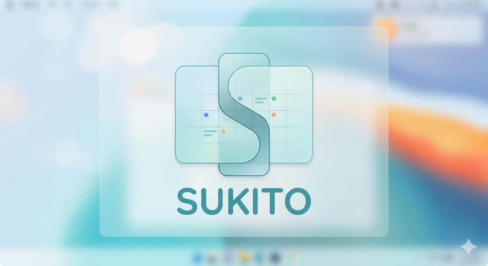
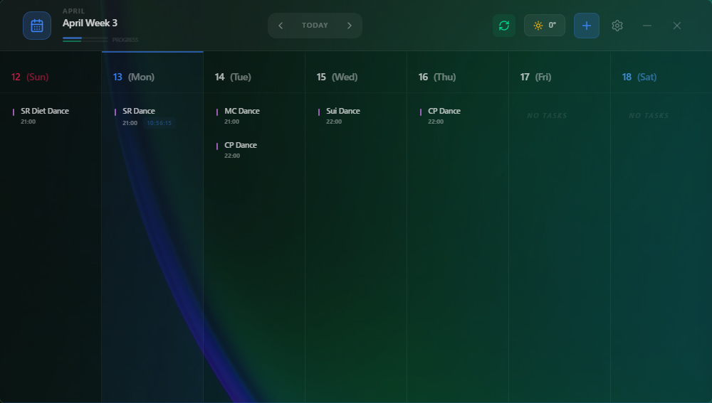
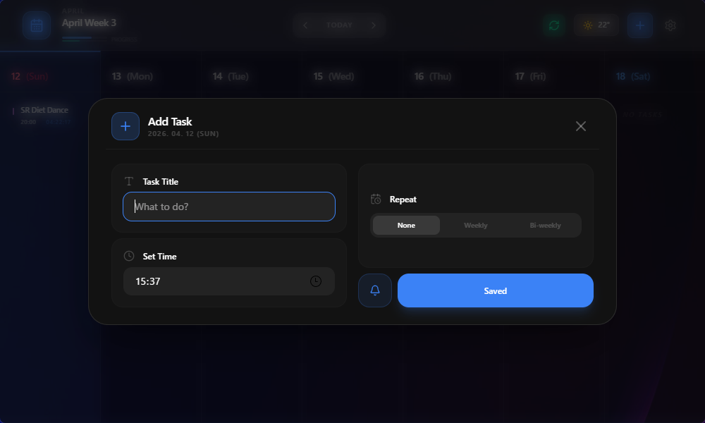
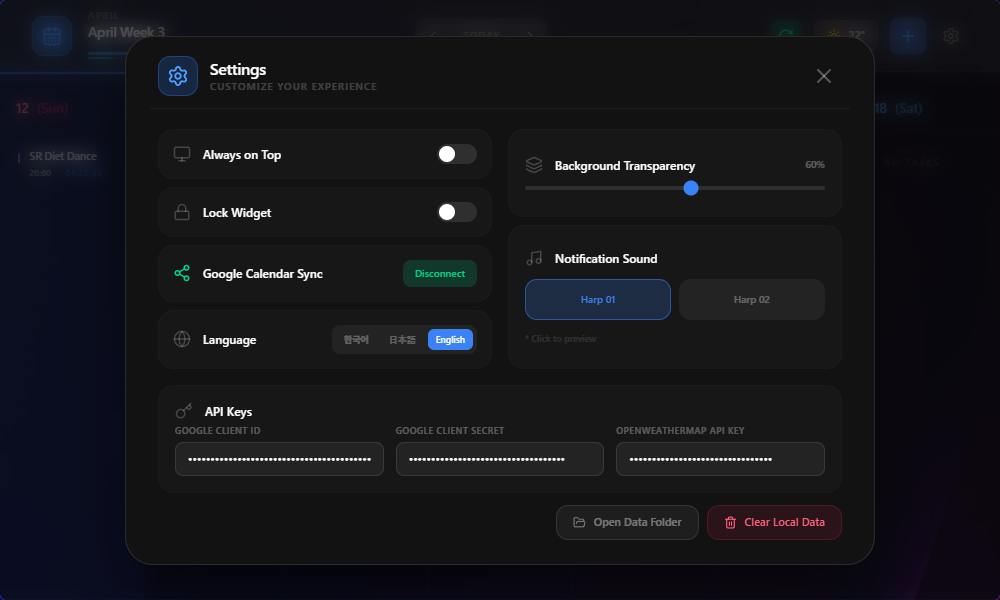

# Sukito

> A desktop calendar widget that syncs with Google Calendar and adapts its look based on your Windows accent color and the current weather outside.


**언어 / 言語:** [한국어](https://github.com/VRSoda/Sukito/wiki/한국어) · [日本語](https://github.com/VRSoda/Sukito/wiki/日本語)

---

## Preview



| Main | New Task | Settings |
|------|----------|----------|
|  |  |  |

---

## Download

Grab the latest build from the [Releases](https://github.com/VRSoda/Sukito/releases) page:

| File | Description |
|------|-------------|
| `Sukito_x.x.x_x64_en-US.msi` | Windows installer (MSI) |
| `Sukito_x.x.x_x64-setup.exe` | Windows installer (NSIS) |

---

## Features

### Glassmorphism UI

- **Windows 11 Mica-style blur**: 70px backdrop blur with saturation tuning for a frosted glass feel
- **Accent color sync**: Automatically picks up your Windows accent color and applies it to the theme
- **Borderless layout**: Sits cleanly on top of your wallpaper with no window chrome

### Calendar

- **Two-way Google Calendar sync**: Changes reflect instantly in both directions, with per-week caching (30min TTL) to keep API calls low
- **Stays logged in**: Uses refresh tokens so you only sign in once
- **Recurring events**: Supports weekly and biweekly repeats
- **Time progress bar**: Shows how far through the day and month you are
- **10-minute reminders**: Plays a sound and sends a system notification before each event

### Weather

- **Live weather**: Fetches current conditions and temperature every 30 minutes via the Rust backend
- **Animated backgrounds**: Rain, snow, and lightning each get their own visual effect

### Other

- **Multilingual**: Auto-detects your Windows display language on first launch (Korean, Japanese, English)
- **Widget lock**: Prevents accidental clicks or drags
- **Background opacity**: Adjustable with a slider in real time
- **Local data management**: Open the data folder or wipe everything from the settings screen

---

## Tech Stack

| Layer | Tech |
|-------|------|
| Frontend | React 19, TypeScript, Tailwind CSS v4, Framer Motion |
| Desktop | Tauri 2 (Rust) |
| Date handling | date-fns, date-fns-tz |
| APIs | Google Calendar API v3, OpenWeatherMap, ip-api |
| Other | winreg, LocalStorage |

---

## Getting Started

### Prerequisites

- [Node.js](https://nodejs.org/) 18+
- [Rust](https://www.rust-lang.org/tools/install) (stable)
- [Tauri prerequisites](https://tauri.app/start/prerequisites/)

### Install

```bash
git clone https://github.com/VRSoda/Sukito.git
cd Sukito
npm install
```

### Run and build

```bash
# dev mode
npm run tauri dev

# production build
npm run tauri build
# output goes to src-tauri/target/release/bundle/
```

---

## API Keys

### Google Calendar

Google OAuth is built into the app — no setup required. Just click **Login** in settings and sign in with your Google account.

> **Note:** You may see a *"Google hasn't verified this app"* warning. This is expected while OAuth verification is in progress. It is safe to proceed by clicking **Advanced → Go to Sukito (unsafe)**. This warning will be removed once approved.

### OpenWeatherMap

Required for weather display. Free tier is sufficient.

1. Sign up at [openweathermap.org](https://openweathermap.org)
2. Generate an API key
3. Paste it into the app settings

---

## Reporting Issues

Found a bug or have a feature request? Open an issue on the [Issues](https://github.com/VRSoda/Sukito/issues) page.

When reporting a bug, please include:
- What you were doing when it happened
- What you expected vs. what actually happened
- Your Windows version and Sukito version

---

## Privacy Policy

[https://vrsoda.github.io/Sukito/](https://vrsoda.github.io/Sukito/)

---

## License

MIT — do whatever you want with it.
